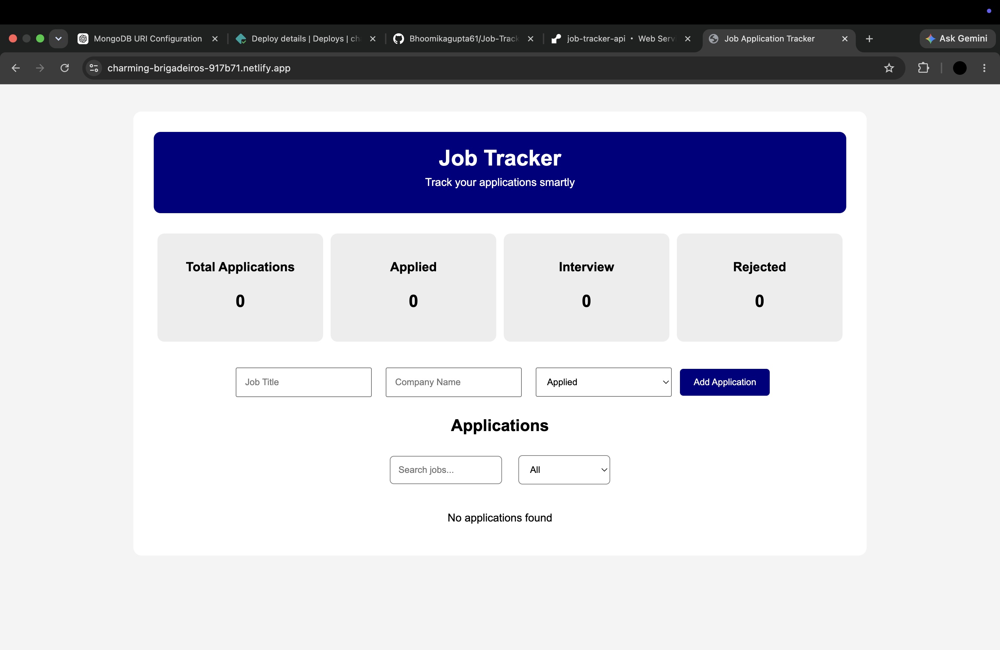
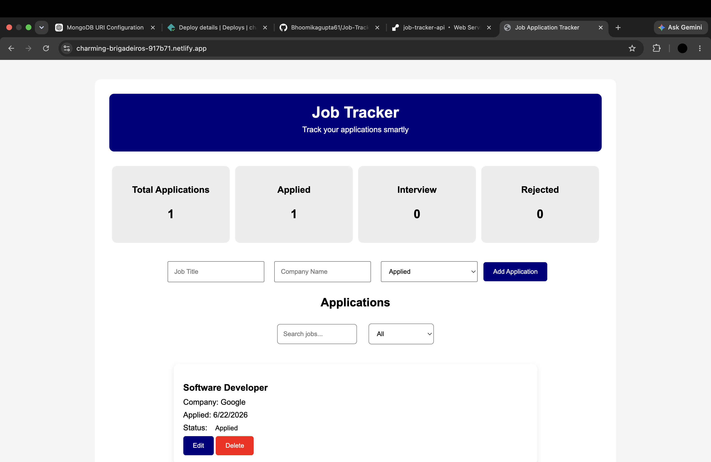
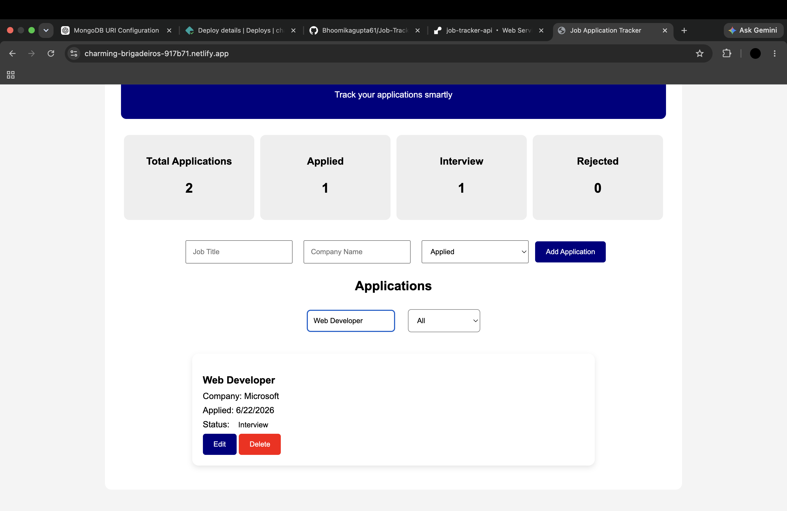

# Job Application Tracker

A full-stack web application that helps users organize, track, and manage job applications efficiently. The application allows users to add, update, search, filter, and delete job applications while storing data securely in MongoDB Atlas.

## Live Demo

**Frontend:** https://charming-brigadeiros-917b71.netlify.app

**Backend API:** https://job-tracker-api-g89f.onrender.com

## Features

* Add new job applications
* Edit existing applications
* Delete applications
* Search applications by title or company
* Filter applications by status
* Dashboard statistics
* Persistent cloud database storage
* Responsive and user-friendly interface

## Tech Stack

### Frontend

* HTML5
* CSS3
* JavaScript (ES6)

### Backend

* Node.js
* Express.js

### Database

* MongoDB Atlas
* Mongoose

### Deployment

* Netlify (Frontend)
* Render (Backend)

## API Endpoints

### Get All Jobs

GET `/api/jobs`

### Create Job

POST `/api/jobs`

### Update Job

PUT `/api/jobs/:id`

### Delete Job

DELETE `/api/jobs/:id`

## Project Structure

```text
Job-Tracker/
│
├── backend/
│   ├── models/
│   ├── routes/
│   ├── server.js
│   └── package.json
│
├── index.html
├── style.css
├── script.js
├── README.md
└── .gitignore
```

## Installation

### Clone the Repository

```bash
git clone https://github.com/Bhoomikagupta61/Job-Tracker.git
```

### Install Backend Dependencies

```bash
cd backend
npm install
```

### Configure Environment Variables

Create a `.env` file inside the backend folder:

```env
MONGO_URI=your_mongodb_connection_string
PORT=5000
```

### Start the Backend Server

```bash
npm run dev
```

### Open Frontend

Open `index.html` in your browser or deploy using Netlify.

## Future Improvements

* User Authentication
* Interview Tracking
* Notes Section
* Analytics Dashboard
* Resume Upload Feature
* Email Notifications

## Author

**Bhoomika**

GitHub: https://github.com/Bhoomikagupta61

## Screenshots

### Dashboard



### Job List



### Search & Filter

